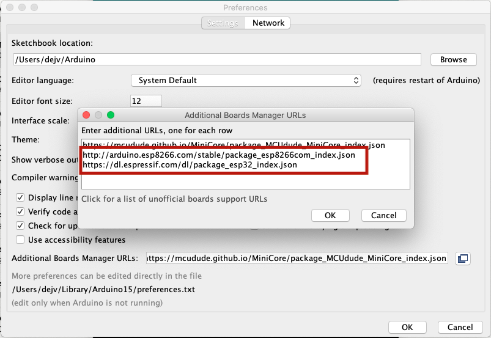
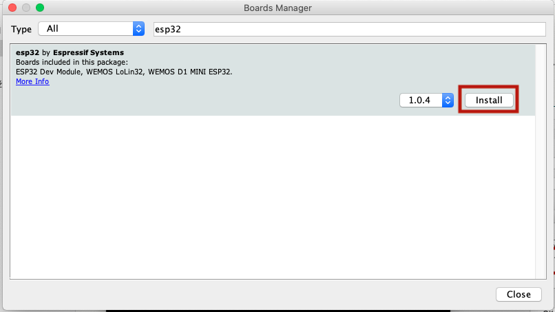
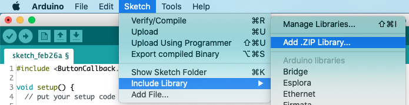

# Environment sensor

Environment sensor project measuring air temperature and humidity. It is made for on LILIGO [TTGO-T-Display](http://www.lilygo.cn/claprod_view.aspx?TypeId=21&Id=1128&FId=t28:21:28) (development board with ESP32 chip and TFT display), but it can be modified to run on Arduino, NodeMCU or any other similar device.

## Wiring
This project uses BME280 module for the measurements. Wiring the this module to TTGO is following.

```
BME280 | TTGO
----------------------
Vcc    | 5V pin
Gnd    | G pin (GND)
SDA    | pin 21 (SDA)
SCL    | pin 22 (SCL)
```

TTGO uses different I2C (SCL and SDA pins) mapping than Arduino. This is reflected in the code (by calling `Wire.begin(21, 22);` in `setup()`). When using different development board, keep this in mind and change the mapping accordingly.

## Setup
First rename (or copy) `config.h.example` to `config.h` and set your WiFi credentials along with the ThingSpeak API key (lines 2, 3 and 6). Then set up your Arduino IDE for TTGO module, install required libraries and upload the code.

Warning: Be sure to keep the `config.h` in the `.gitignore` file and not to commit it anywhere to prevent your credentials leakage!

You can change the other constants in your `config.h` to change the measurement frequency, how often the data should be sent to the server along with settings to display the data on TFT. Be aware that only font supporting the degree (°) I found is the font number 1.

If you did not setup your TTGO yet, follow the instructions below.

## Setting up TTGO

You need to do some extra steps to set up your Arduino IDE to work with TTGO module.
1. Add the following URL to Additional boards manager URLs in Settings

```
https://dl.espressif.com/dl/package_esp32_index.json
http://arduino.esp8266.com/stable/package_esp8266com_index.json
```



2. Install ESP32 board in the Board manager (Tools > Development board > Board manager)



3. Install library **TFT_eSPI** (by Bodmer) in Sketch -> Include Library -> Manage Libraries
4. Install library **Button2** (by LennartHennigs). Personally I could not find it in the Manage Libraries window. You can install it manually by downloading [this ZIP](https://github.com/lennarthennigs/Button2/zipball/master), then navigating to Sketch -> Include Library -> Add .ZIP Library... and selecting it. 



5. Modify User_Setup_Select.h file in your libraries folder (on Mac in ~/Arduino/Libraries/TFT_eSPI). Comment out the default settings line
```
#include <User_Setup.h> 
```

and uncomment line 
```
#include <User_Setups/Setup25_TTGO_T_Display.h>
```

6. Select the ESP32 development board in Tools > Development board > ESP32 Dev Module

7. Make sure the correct Port is selected in Tools and upload the program